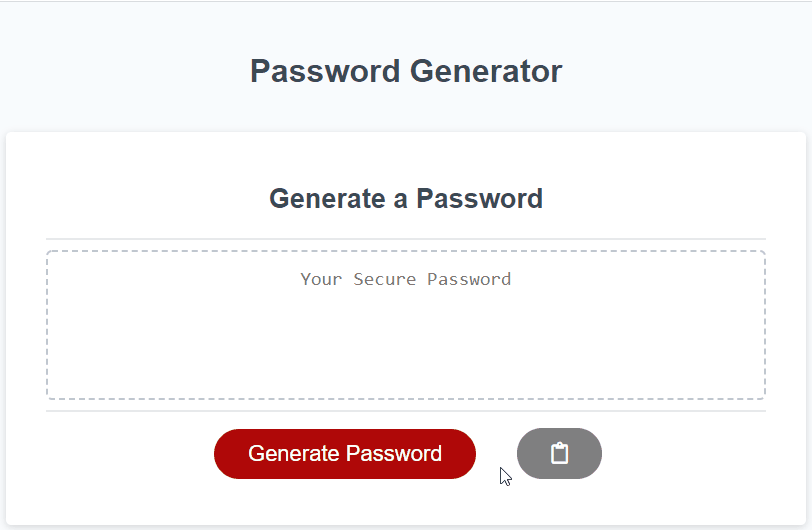

# Password Generator

## Objective

To create an automatic password generator based on *_User_* needs. 

## User Story

```
AS AN employee with access to sensitive data
I WANT to randomly generate a password that meets certain criteria
SO THAT I can create a strong password that provides greater security
``` 

## Acceptance Criteria

```
GIVEN I need a new, secure password
WHEN I click the button to generate a password
THEN I am presented with a series of prompts for password criteria
WHEN prompted for password criteria
THEN I select which criteria to include in the password
WHEN prompted for the length of the password
THEN I choose a length of at least 8 characters and no more than 128 characters
WHEN prompted for character types to include in the password
THEN I choose lowercase, uppercase, numeric, and/or special characters
WHEN I answer each prompt
THEN my input should be validated and at least one character type should be selected
WHEN all prompts are answered
THEN a password is generated that matches the selected criteria
WHEN the password is generated
THEN the password is either displayed in an alert or written to the page
```

## Task List
- ✅ Prompted for uppercase and lowercase letters.
- ✅ Prompted for numbers.
- ✅ Prompted for symbols.
- ✅ Password length <u>must be</u> between 8 to 128 characters.
- ✅ Password generated matches the criteria selected by the user.
- ✅ Password is displayed in text and could be copied.
- <b>Bonus</b>
- 🚀 Clipboard button included for easy copy. 

## Preview 
Visit the site [here](https://eddyangang.github.io/password_generator_v2/).

